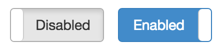
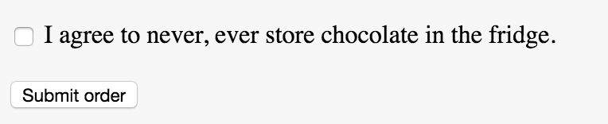

# React Actions

## Objectives

1. Explain how modularizing actions helps us modularize applications
2. Describe the anatomy of a React action
3. Practice moving from event handler to generic action

## Overview

One way to communicate between components by is by passing around handler
functions, e.g. a button usually has an `onClick` handler, while a custom modal
component might accept an `onClose` function.

While it's certainly possible to structure your component hierarchy using
`on...` handlers, this approach is rather inflexible and leads to a lot of code
duplication in the long term.

In this lesson we're going to be learning how decoupling those functions into
isolated `actions` allows us to de-couple handlers from the component they
operate on.

## Toggling State

A lot of components have two states:

- a toggle button for instance is either "on" or "off"
- an input field can be enabled or disabled
- a checkbox can either be ticked or unticked
- a log paragraph of text could either be collapsed or expanded

### Toggle Button

Let's first have a look at a simple example: A toggle button.



A toggle button can either be enabled or disabled.

Using what we already learned about state, we could easily implement such a
switch:

```js
class ToggleButton extends React.Component {
  constructor (props) {
    super(props);
    this.state = {
      // initially our `ToggleButton` is 
      enabled: false
    };
  }
  handleClick () {
    this.setState({
      // negate enabled
      enabled: !this.state.enabled
    });
  }
  render () {
    return (
      <button onClick={this.handleClick}>
        {this.state.enabled ? 'Enabled' : 'Disabled'}
      </button>
    );
  }
}
```

Our component renders a button. If the toggle button is in the `enabled` state,
we display the "Enabled" lable, otherwise we consider the button to be
"Disabled".

### Enabled / Disabled Inputs

Not only toggle buttons can be toggled, but also checkboxes. A checkbox is
either enabled or disabled.

Implementing a form containing a checkbox (e.g. for one of those legal
disclaimers) is trivial:



Similar to the toggle button above, the checkbox would have an enabled and
disabled state.

```js
class ChocolateDisclaimer extends React.Component {
  constructor (props) {
    super(props);
    this.state = {
      // a customer first has to promise not to store the chocolate in the
      // fridge
      enabled: false
    };
  }
  handleClick () {
    this.setState({
      enabled: !this.state.enabled
    });
  }
  render () {
    return (
      <form>
        <label>
          <input type='checkbox' checked={this.state.enabled} onClick={this.handleClick} />
          I agree to never, ever store chocolate in the fridge.
        </label>
        <button onClick={...} disabled={this.state.enabled}>Submit order</button>
      </form>
    )
  }
}
```

As we can see, this component looks fairly similar to the toggle button above.
The only real difference is that instead of a toggle "button", we now have an
input of type `checkbox`. Other than that, everything remains the same.

Wouldn't it be nice if we could de-duplicate this logic and extract out the
redundant `handleClick` handler?

### Modularizing actions

If we look at the code of the toggle button and chocolate disclaimer, we notice
that the click handlers are completely **identical**.

Code redundancy is never a good thing, therefore we should try to extract out
our `handleClick` function.

One way would be to have a super-class `Toggleable` that both
`ChocolateDisclaimer` and `ToggleButton` inherit from:

```js
class Toggleable extends React.Component {
  toggleState () {
    this.setState({
      enabled: !this.state.enabled
    });
  }
}
```

`ToggleButton` could then inherit from this superclass:

```js
class ToggleButton extends Toggleable {
  constructor (props) {
    super(props);
    this.state = {
      // initially our `ToggleButton` is 
      enabled: false
    };
  }
  render () {
    return (
      <button onClick={this.toggleState}>
        {this.state.enabled ? 'Enabled' : 'Disabled'}
      </button>
    );
  }
}
```

This is already a bit better, but becomes quickly unmanageable. A component
might for instance be `Toggleable` and `Submittable`… which becomes a bit messy
very quickly. JavaScript doesn't support multiple-inheritance (inheriting from
more than one class at once) and building our own mixin system is a bit
unnecessary.

Instead, we can extract out our handler into a separate "action".

An action is just a plain function that accepts a context (`ctx`) and arbitrary
additional arguments (for instance the event itself in case we want to
`.preventDefault()`):

```js
function toggleState (ctx, ev) {
  ctx.setState({
    enabled: !ctx.state.enabled
  });
}
```

`ctx` is the `this` context of the component that the action is "bound" to.

The above action could be used in the `ToggleButton` as well as the
`ChocolateDisclaimer`.

In both cases, the context would be `this`. The action would be bound inside the
component's constructor function:

```js
class ToggleButton extends React.Component {
  constructor (props) {
    super(props);
    this.state = { enabled: false };
    this.toggleState = () => toggleState(this);
  }
  render () {
    // ...
  }
}
```

Instead of using an arrow function, we could also "curry" the `toggleState`
function. Currying a functions means converting a function that accepts multiple
arguments into a function that accepts one argument at a time:

```js
function toggleState (ctx, ev) {
  ctx.setState({
    enabled: !ctx.state.enabled
  });
}
```

could also be written as

```js
const toggleState = ctx => {
  // actual event handler
  return ev => {
    ctx.setState({
      enabled: !ctx.state.enabled
    });
  }
}
```

or, if you want to keep it really concise:

```js
const toggleState = ctx => ev =>
  ctx.setState({
    enabled: !ctx.state.enabled
  });
```

This has the advantage that we no longer need to wrap our `toggleState` function
inside the component's constructor:

```js
class ToggleButton extends React.Component {
  constructor (props) {
    // ...
    this.toggleState = () => toggleState(this);
  }
  // ...
}
```

could instead be written as without the outer arrow function:

```js
class ToggleButton extends React.Component {
  constructor (props) {
    // ...
    this.toggleState = toggleState(this);
  }
  // ...
}
```

And that's it! Now we modularized our `toggleState` handler! Instead of
duplicating our `handleClick` handler, we can now apply the `toggleState`
function to anything that can be toggled or turned on / off. It doesn't matter
if it's a button, "Collapse"-button, input or lightsaber. Everything that can be
enabled or disabled can be toggled by our `toggleState` function.


## Resources

- [Flux: Actions](https://facebook.github.io/react/blog/2014/07/30/flux-actions-and-the-dispatcher.html)
